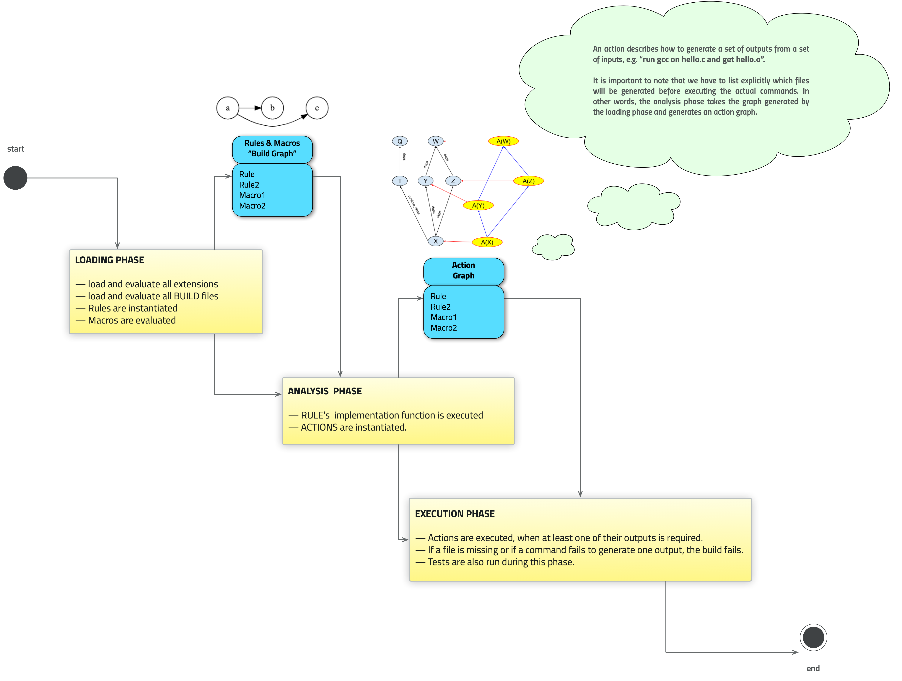
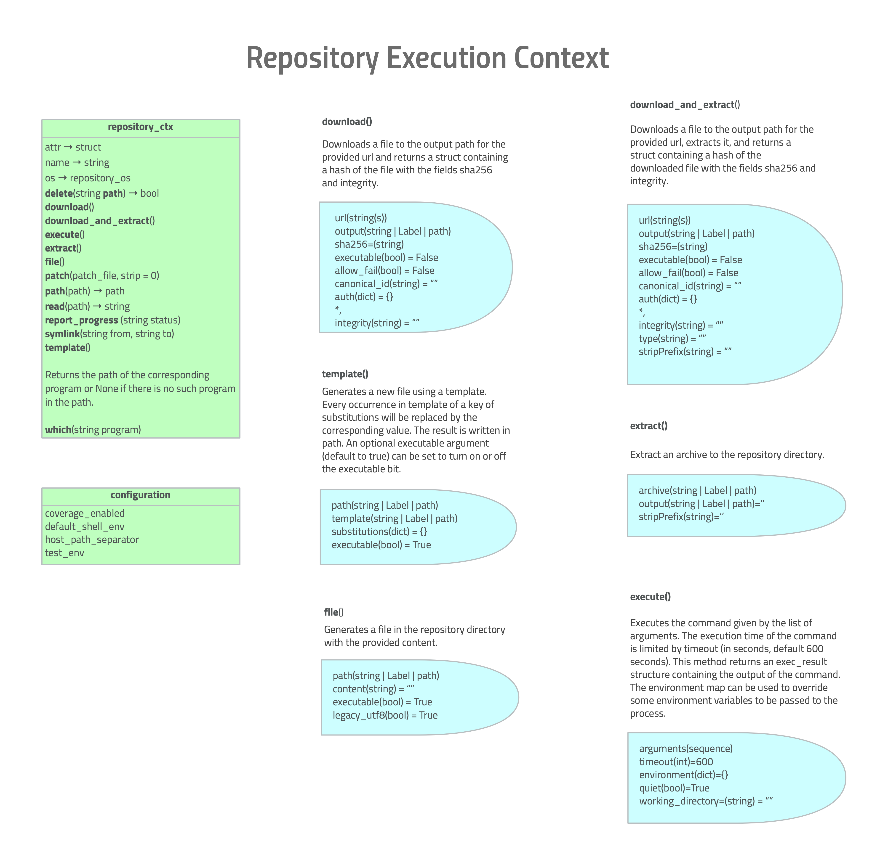
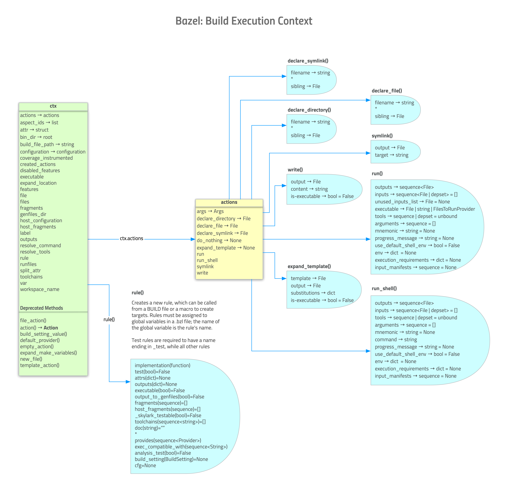
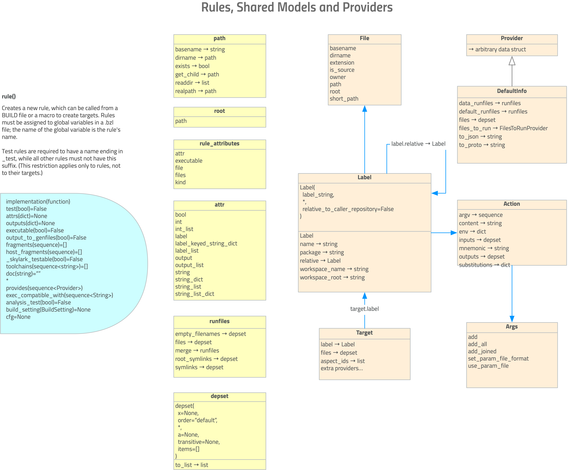

= Bazel in Diagrams
:toc:
:sectnums:
:toclevel: 5

This repo contains several UML-ish diagrams hopefully making it easier to understand the Bazel API for those new to Bazel, or new to customizing Bazel.

The source file was created in OmniGraffle, but lease feel free to contribute images made with ANY tool, and we find them useful we'll merge.

== Diagrams

=== Build Phases

'''

=== Repository Rules

'''

=== Build Context

'''

=== Rules, Shared Models, Providers

'''

== Copyright

© 2018-2020 Konstantin Gredeskoul & BazelRuby Authors

Licensed under the Apache License, Version 2.0 (the "License"); you may not use this file except in compliance with the License. You may obtain a copy of the License at

http://www.apache.org/licenses/LICENSE-2.0

Unless required by applicable law or agreed to in writing, software distributed under the License is distributed on an "AS IS" BASIS,
WITHOUT WARRANTIES OR CONDITIONS OF ANY KIND, either express or implied. See the License for the specific language governing permissions and limitations under the License.
